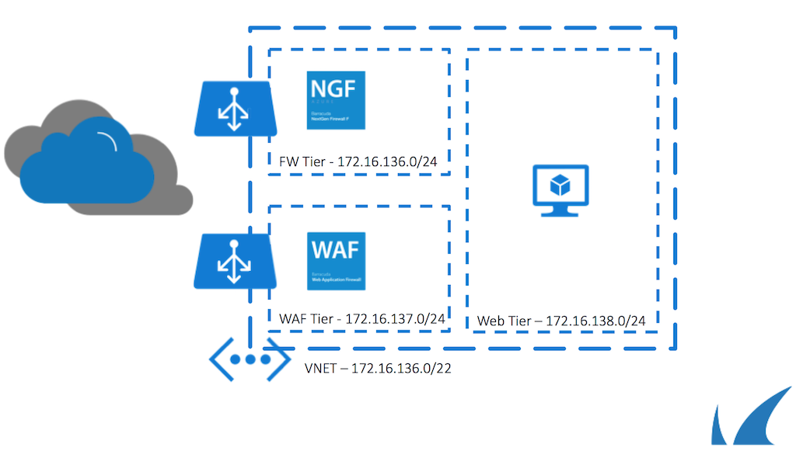

# Barracuda Hands On Session 2016

The following templates can be used to deploy the Barracuda solutions used in the Hands On Sessions.

Deployment of the Networking, Barracuda NextGen Firewall, Barracuda Web Application Firewall and Windows Server can be started from the 'Deploy_ARM_Templates_PSv1.ps1' script. This script will create resources groups per component.

Deploy User Defined Routing 
 

